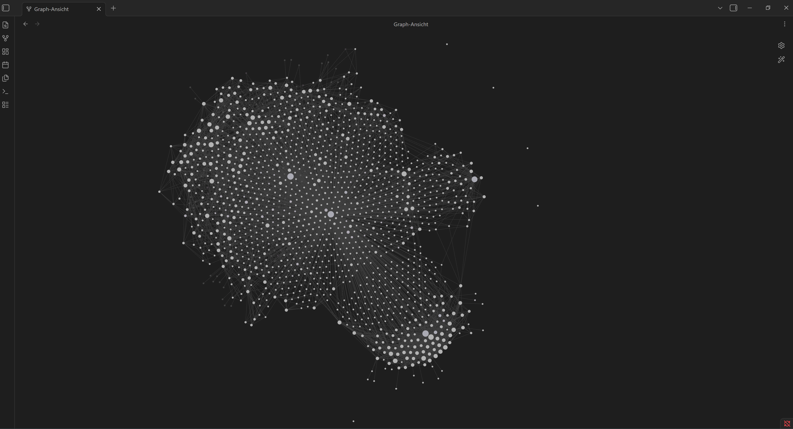

# 🧠 Steuererklärung Brain

> **372 Paragraphen. Drei Gesetze. Ein Graph.**
> EStG · UStG · GewStG — vollständig modelliert als verlinkter Obsidian-Wissensgraph.
> Die präzise, lokale Wissensquelle für LLMs zu allen deutschen Steuerfragen.




*Der Obsidian Graph zeigt das eigentliche Herz dieses Projekts: ein wachsendes Netz aus Gesetzen, Paragraphen, Begriffen und Querverweisen. Aus einzelnen Steuerregeln entsteht ein navigierbares Brain.*

## Worum es geht

Dieses Repository ist kein klassischer Notizordner. Es ist ein strukturierter Wissensgraph für deutsches Steuerrecht: Gesetze, Paragraphen, Begriffe und praktische Zusammenhänge werden als Obsidian-Wiki gepflegt und miteinander verlinkt.

Das Brain ist darauf ausgelegt, Steuerfragen nicht isoliert zu betrachten, sondern als Netz:

- Welche Paragraphen betreffen eine konkrete Ausgabe?
- Welche Begriffe tauchen in mehreren Gesetzen wieder auf?
- Wie hängen Einkommensteuer, Umsatzsteuer und Gewerbesteuer zusammen?
- Welche Regeln sind für Arbeitnehmer mit Nebengewerbe besonders relevant?
- Wo entstehen Pflichten bei Rechnungen, Vorsteuer, Betriebsausgaben oder Kleinunternehmerregelung?

## Enthaltene Gesetze

| Gesetz | Umfang im Vault | Wofür es wichtig ist |
|---|---:|---|
| Einkommensteuergesetz (EStG) | 243 Paragraphseiten | Einkommensteuer, Einkunftsarten, Werbungskosten, Betriebsausgaben, Gewinnermittlung, Sonderausgaben, Arbeitnehmerbesteuerung |
| Umsatzsteuergesetz (UStG) | 88 Paragraphseiten | Umsatzsteuer, Kleinunternehmerregelung, Rechnungen, Vorsteuer, Leistungsort, Besteuerungsverfahren |
| Gewerbesteuergesetz (GewStG) | 41 Paragraphseiten | Gewerbeertrag, Hinzurechnungen, Kürzungen, Messbetrag, Hebesatz, Vorauszahlungen |

Jeder Paragraph ist als eigene Markdown-Seite modelliert, mit Volltext, wichtigen Begriffen und expliziten Verweisen auf andere Paragraphen.

## Perfekt für

Dieses Brain ist besonders nützlich für:

- Angestellte mit Kleingewerbe oder Nebengewerbe
- Selbstständige KI-, Automatisierungs- und Software-Dienstleister
- Vorbereitung und Strukturierung der eigenen Steuererklärung
- Recherche zu Betriebsausgaben, Werbungskosten und Abschreibungen
- Umsatzsteuerliche Fragen rund um Rechnungen, Vorsteuer und Kleinunternehmer
- Aufbau eines persönlichen steuerlichen Recherche-Assistenten
- LLM-gestützte Arbeit mit einem kontrollierten lokalen Wissensbestand

## Obsidian als Steuer-Graph

Der Vault ist für Obsidian gebaut. Dadurch wird aus Gesetzestexten ein navigierbarer Graph:

- Paragraphen verlinken auf zentrale Begriffe.
- Begriffe verlinken zurück auf relevante Paragraphen.
- Quellen bleiben nachvollziehbar in `archive/`.
- Synthesen und Abfragen können später als eigene Wiki-Seiten gespeichert werden.
- Der Graph View macht sichtbar, welche Themen stark miteinander verbunden sind.

Statt einzelne Steuerfragen immer wieder neu zu recherchieren, wächst hier ein lokales, versioniertes Steuerwissen.

## Projektstruktur

```text
.
+-- wiki/
|   +-- index.md          # Master-Katalog aller Wiki-Seiten
|   +-- log.md            # Chronologisches Arbeitslog
|   +-- sources/          # Übersichtsseiten zu Quellen und Gesetzen
|   +-- concepts/         # Steuerliche Begriffe und Konzepte
|   +-- gesetze/          # Eine Seite pro Gesetzesparagraph
|   +-- synthesis/        # Analysen, Vergleiche und Querverbindungen
+-- archive/              # Verarbeitete Originalquellen
+-- AGENTS.md             # Arbeitsregeln für Codex-Agenten
+-- CLAUDE.md             # Arbeitsregeln für Claude-Agenten
+-- .codex/skills/        # Lokale Skills für Abfragen gegen das Brain
+-- .claude/skills/       # Lokale Skills für Claude-Workflows
```

## Wie das Wissen modelliert ist

Jede Wiki-Seite besitzt YAML-Frontmatter mit Tags, Quellen, Erstellungsdatum und Aktualisierungsdatum. Paragraphseiten enthalten zusätzlich Gesetz und Paragraph.

Eine typische Paragraphseite besteht aus:

- Volltext des Paragraphen
- wichtigen Begriffen als `[[wikilinks]]`
- verwandten Paragraphen, sofern sie im Gesetz explizit referenziert werden
- Rückverbindung zur Gesetzesübersicht

Dadurch kann ein LLM gezielt im lokalen Wissensbestand suchen, ohne den Kontext aus unstrukturierten Dateien erraten zu müssen.

## Beispiel-Fragen an das Brain

- Welche Betriebsausgaben sind für mein KI-Kleingewerbe relevant?
- Wann lohnt sich die Kleinunternehmerregelung und wann nicht?
- Wie unterscheiden sich Werbungskosten und Betriebsausgaben?
- Welche UStG-Regeln brauche ich für Rechnungen an Unternehmen?
- Welche Paragraphen betreffen Vorsteuerabzug und Rechnungsangaben?
- Was muss ich als Angestellter mit Nebengewerbe bei der Steuererklärung beachten?
- Welche Zusammenhänge gibt es zwischen EStG, UStG und GewStG?

## GitHub-Ziel

Dieses Repository repräsentiert den öffentlichen, kuratierten Teil des Steuer-Brains:

- `wiki/` für das eigentliche Wissen
- `archive/` für nachvollziehbare Quellen
- Agenten-Anweisungen und Skills für reproduzierbare Workflows
- README und Lizenz für die Projektpräsentation

Nicht gedacht für den Upload sind persönliche Rohdaten, lokale Obsidian-Einstellungen, temporäre Outputs oder private Steuerunterlagen.

## Hinweis

Dieses Projekt ist ein persönliches Wissens- und Recherche-System. Es ersetzt keine Steuerberatung und garantiert keine Aktualität oder Vollständigkeit der Rechtslage. Für verbindliche Entscheidungen sollten Gesetzesstand, Verwaltungsauffassung und fachliche Beratung geprüft werden.
